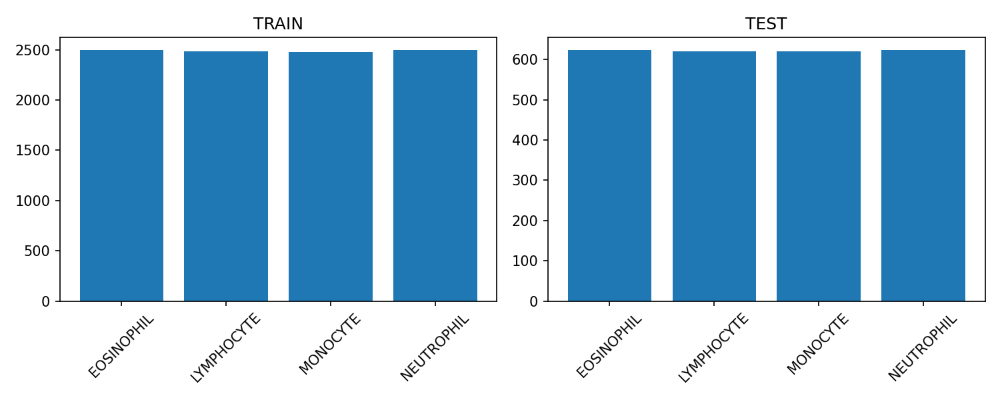
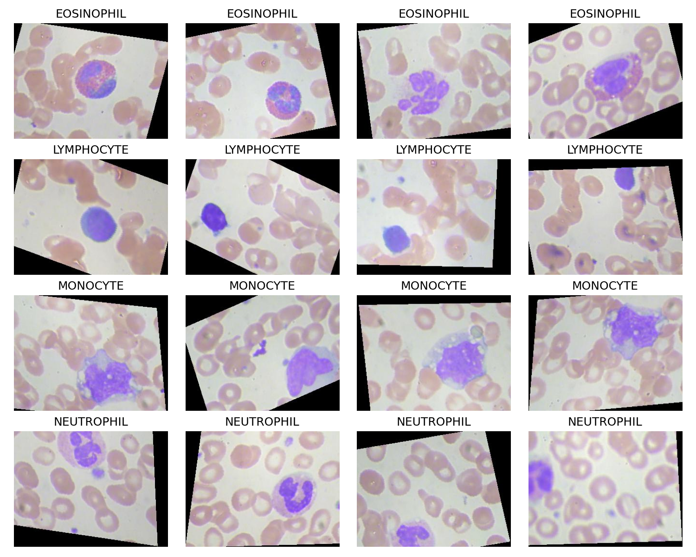
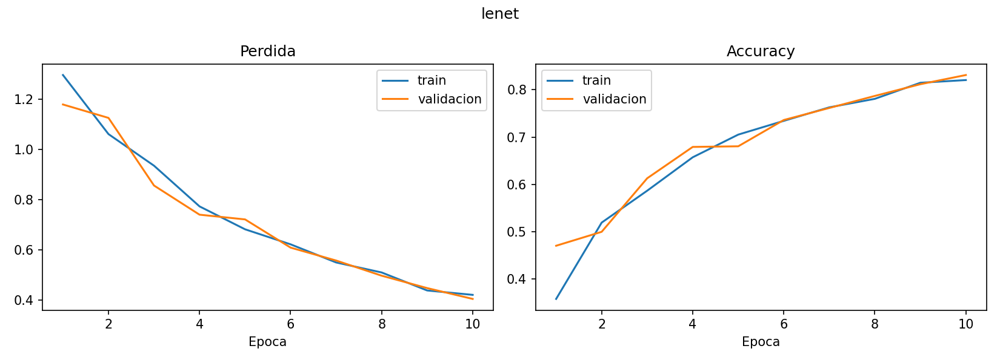
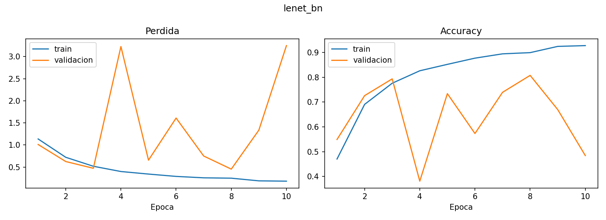
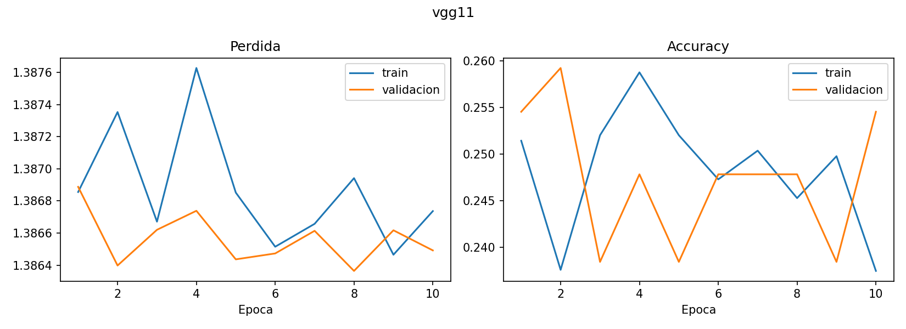
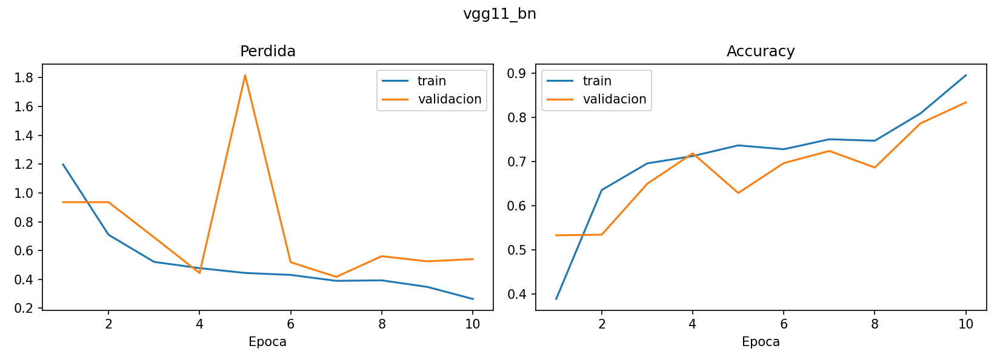
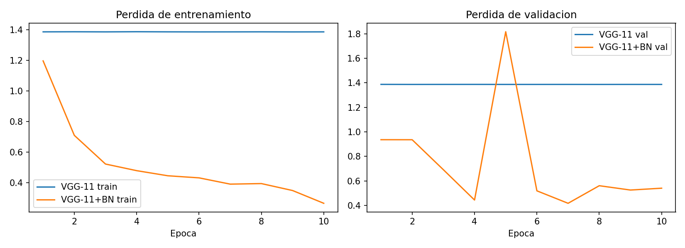
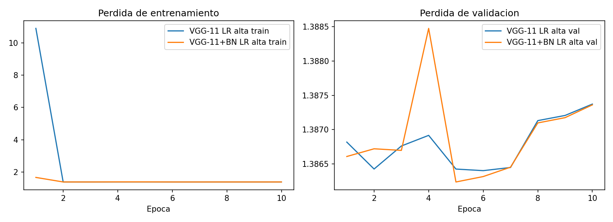
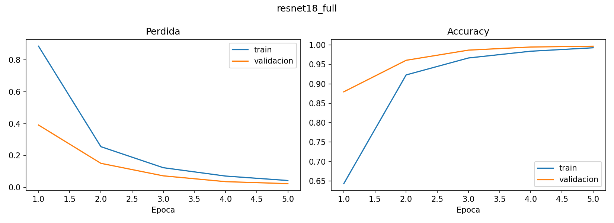
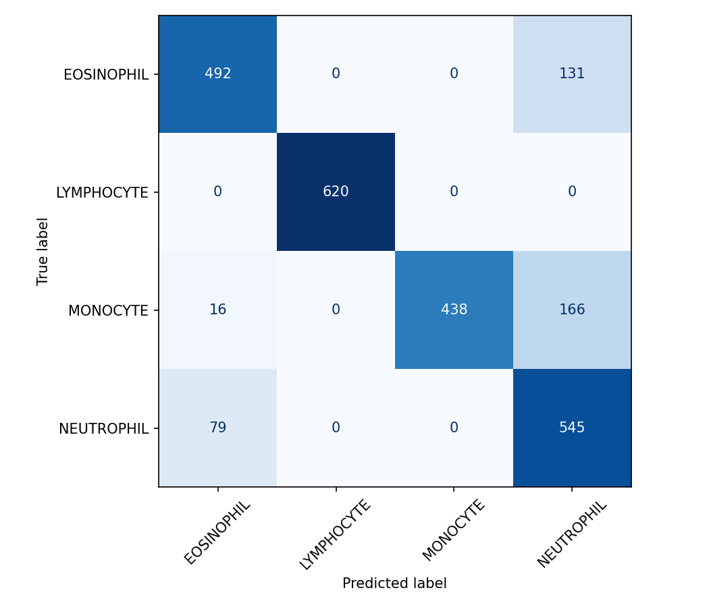

# Informe tecnico: clasificacion de celulas sanguineas

## Introduccion

La clasificacion automatica de celulas sanguineas puede apoyar tareas de tamizaje y analisis asistido en contextos medicos. El dataset contiene imagenes RGB organizadas en cuatro clases: eosinofilos, linfocitos, monocitos y neutrofilos. El objetivo es comparar modelos convolucionales entrenados desde cero, estudiar el efecto de Batch Normalization y evaluar transfer learning con datos limitados.

## Metodologia

Todas las imagenes se redimensionan a `64x64` para LeNet/VGG y a `224x224` para modelos preentrenados. Se usa normalizacion ImageNet, aumento simple en entrenamiento (`RandomHorizontalFlip`, `RandomRotation(10)`), `CrossEntropyLoss` y `AdamW`. El conjunto `TRAIN` se divide en entrenamiento y validacion con `val_split=0.15`; `TEST` se reserva para la evaluacion final.

Arquitecturas desde cero:

- LeNet-5 adaptado: entrada `64x64x3`, dos bloques conv-pool y tres capas fully connected.
- LeNet-5+BN: misma arquitectura con Batch Normalization despues de cada convolucion.
- VGG-11 simplificado: filtros reducidos a la mitad para CPU/Colab.
- VGG-11 simplificado+BN: misma arquitectura con Batch Normalization.

Transfer learning:

- Feature Extraction: solo se entrena la capa FC final.
- Fine-tuning parcial: se entrenan los ultimos bloques y la FC.
- Fine-tuning total: se entrena todo el modelo con learning rate pequeno.

## Resultados

La tabla comparativa se genera desde `results/tables/summary.csv` e incluye parametros totales, parametros entrenables, tiempo medio por epoca, mejor accuracy de validacion, accuracy en test y epocas necesarias para alcanzar 80% de accuracy de validacion. Las curvas se guardan en `results/figures/*_curves.png`.

Para Tarea 1 se reportan cuatro variantes: `lenet`, `lenet_bn`, `vgg11` y `vgg11_bn`. Para Tarea 2 se comparan `vgg11` y `vgg11_bn` con la misma configuracion, y luego se repite el contraste con una tasa de aprendizaje mayor. Para Tarea 3 se reportan `resnet18_feature`, `resnet18_partial` y `resnet18_full`, comparandolos contra el mejor modelo entrenado desde cero.

### Imagenes generadas en los notebooks

Notebook `01_eda.ipynb`:

Notebook `02_lenet_vgg.ipynb`:

Notebook `03_transfer.ipynb`:

## Discusion

Batch Normalization fue propuesto para acelerar el entrenamiento reduciendo el cambio en la distribucion de activaciones internas durante el aprendizaje, fenomeno llamado *Internal Covariate Shift* (Ioffe & Szegedy, 2015). En el experimento controlado, la comparacion valida debe mantener constantes arquitectura, optimizador, batch size, split y augmentations, cambiando solo la presencia de Batch Normalization.

Si la variante con BN alcanza 80% de accuracy en menos epocas o muestra menor perdida de validacion, el resultado es consistente con la idea de que normalizar activaciones intermedias facilita la optimizacion. La corrida con LR alta evalua si BN permite pasos mas grandes sin oscilaciones fuertes o divergencia. Si ambas variantes son estables, el beneficio de BN debe discutirse en terminos de velocidad, generalizacion y costo por epoca, no solo de accuracy final.

Para datos medicos limitados, transfer learning suele ser preferible a entrenar redes profundas desde cero. Feature extraction reduce el riesgo de sobreajuste, pero puede subadaptarse si el dominio difiere mucho de ImageNet. Fine-tuning total es flexible, aunque requiere mas cuidado por el tamano del dataset y puede sobreajustar. Fine-tuning parcial suele ser el compromiso recomendable porque adapta representaciones de alto nivel manteniendo congeladas capas generales.

## Conclusiones

La recomendacion final debe basarse en cuatro criterios: accuracy en test, estabilidad de las curvas, tiempo por epoca y riesgo de sobreajuste. En un contexto clinico con pocos datos, se prioriza un modelo transferido estable y bien validado antes que una red profunda entrenada desde cero, incluso si la diferencia de accuracy es pequena.

## Referencias

- LeCun, Y. et al. (1998). Gradient-Based Learning Applied to Document Recognition.
- Krizhevsky, A., Sutskever, I. & Hinton, G. (2012). ImageNet Classification with Deep Convolutional Neural Networks.
- Simonyan, K. & Zisserman, A. (2015). Very Deep Convolutional Networks for Large-Scale Image Recognition.
- He, K. et al. (2016). Deep Residual Learning for Image Recognition.
- Ioffe, S. & Szegedy, C. (2015). Batch Normalization: Accelerating Deep Network Training by Reducing Internal Covariate Shift.
